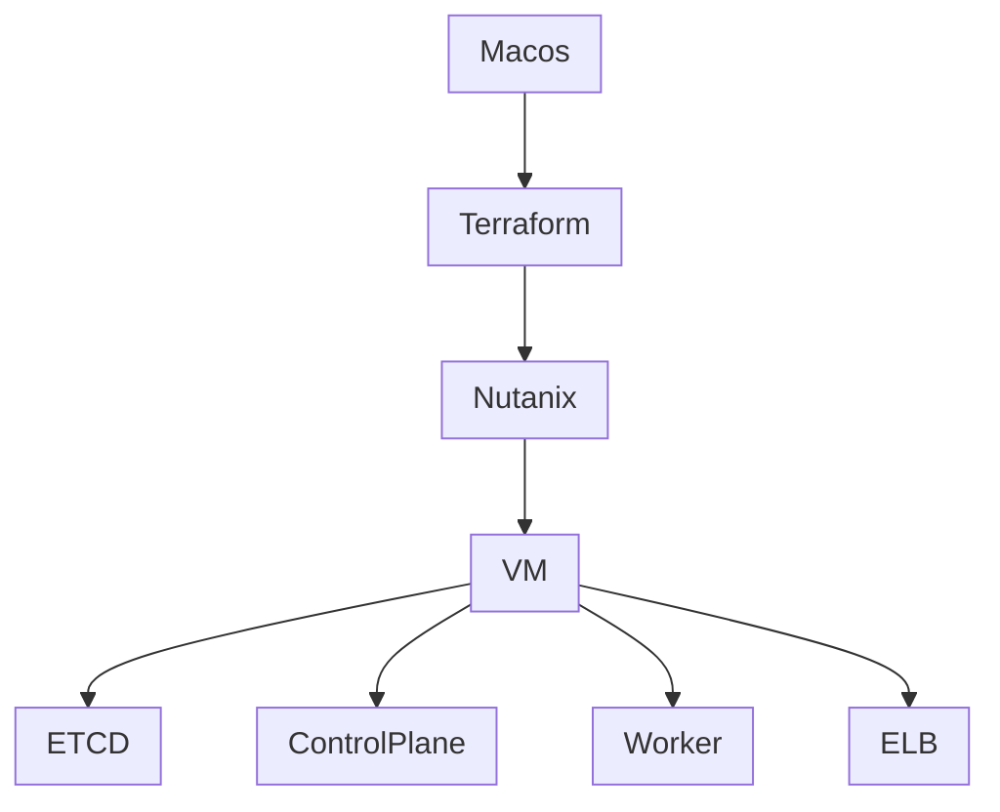

### Overview


#### example config
##### terraform.tfvars
```
# ssh key
ssh_key= "ssh-rsa AAAAB3NzaC1yc2EAAAADAQABAAABAQDHQPduvBBBOALoMK0SMb9oXkORwB4G6pD1ZoNyASTfWmQ0mP/GIUnMoi5RdxOgoHEP9fg+ktqw66Zeamfxa22GYltZf9ayf9rSnENbQeGgbNTFShjYE6q675ryPyx/kWf+yWWdPV4KBg1rjqdWyxcd12f2BPi9cXU1q9W03b2VMrNhuC9lzPD3Fitto/yrlJQ7iVbVn/TvAIJxOAQ/v5wa/QA2uxZ2e95khMfy8t26u2KA5KcHTZ4b/OPq2pjGTeAebfKiB7Ou07fC9NHYp7vj4TZ0ISnyt9ePk1a+SaLeP7eA8ZqEnqIurLrMVhmGNSJ1OT7vGIWpCbms1QJPtWZv root@pve"
# Valid values are intel/amd
system_type = "intel"

# Hypervisor config
PROXMOX_API_ENDPOINT = "https://192.168.1.9:8006/api2/json"
PROXMOX_USERNAME     = "root"
PROXMOX_PASSWORD     = "56255625"
PROXMOX_IP           = "192.168.1.9"
DEFAULT_BRIDGE       = "vmbr0"
TARGET_NODE          = "pve"

# Cluster config
MASTER_COUNT = 3
WORKER_COUNT = 3
ELB_COUNT    = 1
ETCD_COUNT   = 3

autostart = true
master_config = {
  memory  = "4096"
  vcpus   = 2
  sockets = 1
}
worker_config = {
  memory  = "8192"
  vcpus   = 4
  sockets = 1
}
etcd_config = {
  memory  = "2048"
  vcpus   = 2
  sockets = 1
}
elb_config = {
  memory  = "4096"
  vcpus   = 2
  sockets = 1
}
```