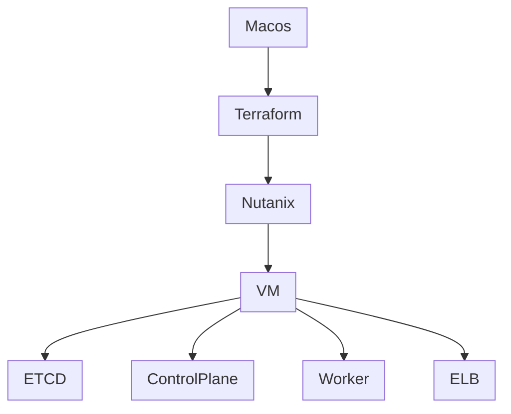

### Overview

#### create nutanix subnet
```
Subnet Name: k8s-subnet
Virtual Switch: vs0
VLAN ID: 0
Enable IP address management [X]
Network IP Prefix: 192.168.1.0/24
Gateway IP Address: 192.168.1.1
DHCP Settings   [X]
Domain Name Servers (Comma separated): 8.8.8.8, 8.8.4.4
IP Address Pools: 192.168.1.30 192.168.1.100
Override DHCP server [X]
DHCP Server IP Address: 192.168.1.200  
#****** vm ip install nutanux
```
#### example config
##### terraform.tfvars
```
nutanix_endpoint = "192.168.1.201"
nutanix_user     = "admin"
nutanix_password = "changeme"
nutanix_cluster_name = "pertisk"
nutanix_subnet_name  = "k8s-subnet"
# ssh key
ssh_key = "ssh-rsa AAAAB3NzaC1yc2EAAAADAQABAAABAQDHQPduvBBBOALoMK0SMb9oXkORwB4G6pD1ZoNyASTfWmQ0mP/GIUnMoi5RdxOgoHEP9fg+ktqw66Zeamfxa22GYltZf9ayf9rSnENbQeGgbNTFShjYE6q675ryPyx/kWf+yWWdPV4KBg1rjqdWyxcd12f2BPi9cXU1q9W03b2VMrNhuC9lzPD3Fitto/yrlJQ7iVbVn/TvAIJxOAQ/v5wa/QA2uxZ2e95khMfy8t26u2KA5KcHTZ4b/OPq2pjGTeAebfKiB7Ou07fC9NHYp7vj4TZ0ISnyt9ePk1a+SaLeP7eA8ZqEnqIurLrMVhmGNSJ1OT7vGIWpCbms1QJPtWZv root@pve"
# ssh user
user        = "almalinux"
# Cluster config
MASTER_COUNT = 2
WORKER_COUNT = 2
ELB_COUNT    = 1
ETCD_COUNT   = 3

master_config = {
  memory  = "4096"
  vcpus   = 2
  sockets = 1
}
worker_config = {
  memory  = "4096"
  vcpus   = 3
  sockets = 1
}
etcd_config = {
  memory  = "1024"
  vcpus   = 1
  sockets = 1
}
elb_config = {
  memory  = "1024"
  vcpus   = 1
  sockets = 1
}
metallb_load_balancer_ip = "192.168.1.40"
istio_version = "1.20.1"
```
